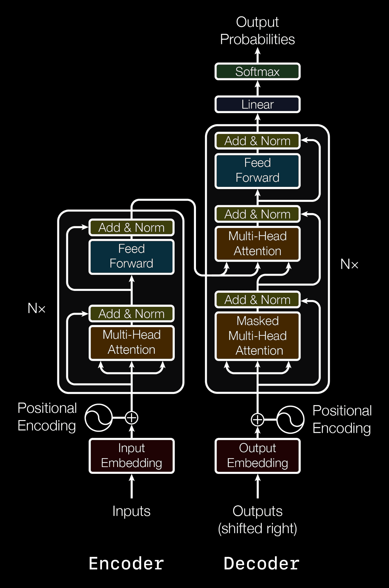

# A.V. College Workshop – Transformers & LLMs

📅 **Date:** 5th July 2025  
🕙 **Time:** 11:30 AM onwards  
📍 **Venue:** MBA Lab, A.V. College of Arts, Science and Commerce (Affiliated to Osmania University)

**Speakers:**  
- Sai Vamsi
- Viswanatha Swamy
- G Yashasri 

---

### 📚 Topics Covered

1. Transformer Architecture  
2. How LLMs like GPT use Transformers  
3. LLM Training Process  
4. Prompt Engineering 

---

### 🛠️ Tools & Technologies

- Python, PyTorch / TensorFlow
- Jupyter Notebook / Colab
- Transformers Library (Hugging Face)
- VS Code / Any IDE

---

## What is a Transformer?

A **Transformer** is a special type of deep learning model that understands and processes language (text) by focusing on how words relate to each other in a sentence.

It uses something called **attention**, which means it looks at **all the words at once** and figures out which words are important for understanding the meaning.

---

##  Why Do We Use Transformers?

Before Transformers, models like RNNs and LSTMs read text word by word in order. They were **slow** and struggled with **long sentences**.

Transformers changed this by:
- Reading the whole sentence **at the same time**  
- Finding important connections between words, no matter how far apart they are  
- Being **faster** and **more accurate** for tasks like translation, summarization, chatting, and coding.

---

## Transformer Architecture

The Transformer has two main parts:
- **Encoder:** Understands the input sentence.
- **Decoder:** Creates the output sentence.

The secret power is **Self-Attention** — this lets the model compare every word with every other word.

A Transformer layer has:
- **Multi-Head Attention:** Looks at the sentence in different ways at the same time.
- **Feed Forward Layer:** Helps process information better.
- **Positional Encoding:** Adds the word order because the model reads the whole input at once.

Transformers stack many of these layers to get better at understanding complex language.



---

## How LLMs like GPT Use Transformers

**GPT** (Generative Pre-trained Transformer) uses only the **Decoder** part.

GPT works like this:
- Reads some text and **predicts the next word** one by one.
- Uses attention to check what has already been written.
- It does not read future words — only past words.

Example:
- If you type: *“The capital of France is…”*  
- GPT guesses the next word: *“Paris”*

---

## How LLMs Are Trained

Training has **two steps**:

**1. Pre-Training:**  
- The model reads huge amounts of text (books, Wikipedia, web pages).
- It learns grammar, facts, common sense.
- The main goal is to predict missing or next words.

**2️. Fine-Tuning:**  
- After pre-training, the model is improved for special tasks like chatting politely or writing code.
- Humans help by giving feedback — so the model learns to be more helpful and safe.

Big LLMs like GPT have **billions of words** in their training data and use **lots of computing power** to learn patterns.

---

## 💡 Summary

- **Transformers** are fast and understand text better than older models.
- They use **attention** to find word relationships.
- GPT uses Transformers to guess the next word and keep the conversation going.
- Training happens in two parts: **Pre-training** (learns basics) and **Fine-tuning** (learns special skills).

---

### Prompt Engineering 
--- 

Prompting is the art of crafting clear instructions for AI models using natural language.  
It helps guide the model’s reasoning, improve accuracy, and ensure structured and relevant responses.

---

## Types of Prompting Techniques
---

## 1. Single-Turn Prompting

**Definition:**  
A basic one-shot interaction where a single prompt yields a single response.  
Useful for simple tasks without context.

**Example:**
```text
Translate "Bonjour" to English.
```

---

## 2. Zero-Shot Prompting

**Definition:**  
Ask the model to perform a task without providing any examples.  
Best for general-purpose queries the model is likely pre-trained on.

**Example:**
```text
Summarize: "Artificial intelligence is a field focused on building systems that mimic human intelligence."
```

---

## 3.Few-Shot Prompting

**Definition:**  
Provide 2–3 examples to show what kind of answer is expected.  
Helps the model learn the desired pattern.

**Example:**
```text
Q: Convert 'data science' to PascalCase  
A: DataScience  
Q: Convert 'student login' to PascalCase  
A: StudentLogin  
Q: Convert 'account settings' to PascalCase  
A:
```

**Bad Prompt:**
```text
data science -> ?
student login ->
```
**Why it's wrong:** Missing consistent format (Q/A), and ambiguous intention.

---

## 4.Multi-Turn Prompting

**Definition:**  
A conversation-like interaction with multiple back-and-forth prompts.  
Ideal for scenarios requiring memory of prior context.

**Example:**
```text
User: What's the capital of France?  
AI: Paris  
User: How far is it from Berlin?  
AI: Approximately 1,050 km by road.
User: What is the best option to reach Berlin?
```

---

## 5.Role Prompting

**Definition:**  
Assign a persona or role to guide the tone, detail, or depth of the answer.  
Useful in simulations, teaching, or reviews.

**Example:**
```text
You are a senior software engineer.  
Please review the following backend code for performance.
```

**Bad Prompt:**
```text
Review this.
```
**Why it's wrong:** No context or role – too vague.

---

## 6. Chain-of-Thought Prompting (CoT)

**Definition:**  
Encourages the model to reason step-by-step before answering.  
Improves performance on math, logic, and planning tasks.

**Example:**
```text
Q: There are 10 apples. Alice eats 4, Bob eats 2. How many are left?  
Let's think step-by-step.
```

---

## 7. Prompt Chaining

**Definition:**  
Break a large task into smaller, logically connected prompts.  
Essential for workflows, automation, and integrations.

**Example:**
```text
Step 1: Summarize the issue: "Login button doesn't work on Safari."  
Step 2: Write a bug report email with that summary.
```

---

## 8. Self-Consistency Prompting

**Definition:**  
Generate multiple reasoning paths for the same prompt, then compare to ensure consistent conclusions.  
Used to verify accuracy and uncover creative variation.

**Example:**
```text
Q: Calculate 15% of 240  
(Provide multiple ways to arrive at the answer)
```

---

## 9. Conversational Prompting (Multi-Turn Memory + Role)

**Definition:**  
A deeper version of multi-turn where the model adapts its answers based on earlier inputs and assigned role.  
Powerful for agents and virtual assistants.

**Example:**
```text
You are my shopping assistant.  
User: Add a new grocery item: 'bananas'.  
AI: Added bananas to your grocery list. Anything else?
User : Add milk and eggs
```

---

## ✅ Best Practices for Prompt Engineering

- **Be clear & specific:** Avoid vague instructions.
- **Add context/examples:** Improve quality with samples.
- **Guide reasoning:** Use "Let's think step-by-step".
- **Assign roles:** Set tone and expertise.
- **Test multiple prompts:** Find what works best.
- **Break down tasks:** Use chaining for complex flows.

---

### 📌 Reference Material

- [GeeksforGeeks – Getting Started with Transformers](https://www.geeksforgeeks.org/machine-learning/getting-started-with-transformers/)
- [Hugging Face Transformers](https://huggingface.co/docs/transformers/index)
- [Prompt Engineering Guide](https://www.promptingguide.ai/)

---

### 🙌 Organized By

- **CDC, A.V. College**
- In association with:  
  - .NET Learners House  
  - Global AI Secunderabad  
  - SHYVN Tech
---

## 🔗 Stay Connected

- [LinkedIn – Yashasri Gudhe](https://www.linkedin.com/in/gyashasri341/)
- [Global AI secunderabad](https://www.meetup.com/global-ai-secunderabad/)
- [Dot Net Learner House](https://www.meetup.com/dot-net-learners-house-hyderabad/)
- Contact: yashasrigudhe@gmail.com

---

*Empowering the next generation of AI learners!* 🚀✨
---
